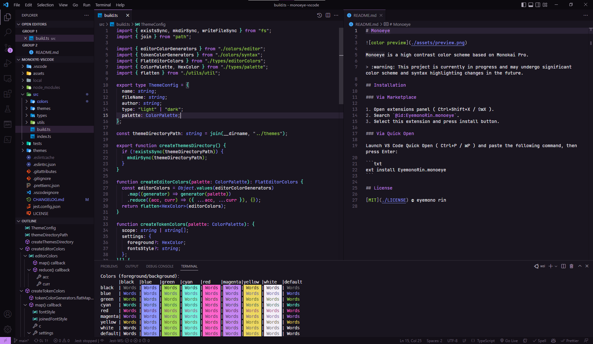

# Monoeye



Monoeye is a high contrast color scheme based on Monokai Pro.

## Installation

### Via Marketplace

1. Open extensions panel ( Ctrl+Shift+X / ⇧⌘X ).
2. Search `@id:EyemonoRin.monoeye`.
3. Select this extension and press install button.

### Via Quick Open

Launch VS Code Quick Open (Ctrl+P / ⌘P) and paste the following command, then press Enter:

```txt
ext install EyemonoRin.monoeye
```

## License

[MIT](./LICENSE) © eyemono rin
